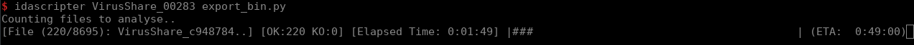

# Idascript

Idascript is a python library allowing to launch idapython script on binary files in a transparent manner.

## Installation

Installing the library can be done with:

    pip install idascript

After installation `idascript` should be ready for import and the script `idascripter`
should be in the path to use the library as a program.

### IDA path

idascript looks for the `idat64`
in the $PATH environment variable but if it is not present the IDA installation path
should be given via the `IDA_PATH` environment variable.

**Command line**

```bash
export IDA_PATH=[your ida path]
idascripter ...
```
or

```bash
IDA_PATH=[your ida path] idascripter ...
```

**Dependencies**: The ``idascripter`` script requires libmagic to identify
executable binaries. It should be available on the system. It can be installed
with:

    sudo apt install libmagic1


**Python library**

If `IDA_PATH` provided to the interpreter, it can be set manually with `os.environ["IDA_PATH"] = [your path]`.

> The easiest way is to export the environment variable in you bashrc

## idascripter

After installation the script `idascripter` is available in the path. It helps
executing idapython scripts on one or multiple binary files in an easy manner.

**Single file**

```bash
idascripter my_binary_file [-s my_script.py] [-t timeout] [my script params | IDA options]
```

> idascripter returns the exit code of the IDA process, which can be itself the exit code of your
script given by `ida_pro.qexit(num)`.

As a recall an idapython script should be architectured like this:

```python
import ida_auto
import ida_pro

ida_auto.auto_wait() # wait for the pre-analysis of IDA to be terminated

# Your script content

ida_pro.qexit(0) #exit IDA with the given return code (otherwise remains opened)
```

> Disclaimer: You should make sure that the import of your script are satisfied (in python2) before
luanching it against binaries

**Multiple files**

If idascripter is given a directory instead of a file, it will recursively iterate all the directory and
subdirectories for executable files. The file type detection is based on `magic` library and analyse files
which ave the following mime type: `application/x-dosexec` (PE, MS-DOS), `application/x-sharedlib` (ELF),
`application/x-mach-binary` (Mach-O), `application/x-executable` (ELF).

When running idascripter shows a progessbar and keeps track of files having a return code other than 0 to
(help post-analysis debug).



Note: An optional parameters (-l/--log) can be precised to have a log file with all the results.

## Library usage

The python library intents to be as simple as possible. 

**Single file analysis**

A single file analysis can performed as follow:

```python
os.environ["IDA_PATH"] = "/path/to/ida" # If not given to the interpreter directly
from idascript import IDA
ida = IDA("/path/binary", "/path/script", [])
ida.start()
retcode = ida.wait()
```

> Note start is not blocking so you can come to pick up the result whenever you want.

**Multiple file analysis**

This works almost similarly to single file analysis except that a file
iterator should be given. A simple usage is:

```python
from idascript import MultiIDA, iter_binary_files
generator = iter_binary_files('/path/to/bins')
for (retcode, file) in MultiIDA.map(generator, "/path/script", []):
    # Do what you want with analysed files yielded
```

> The generator should is not necessarily a generator, thus it can be a list of files to analyse


**Custom file generator**

We might be led to write our own file iterator depending on our needs. Let's consider we want
to analyse only files that have never been analysed namely the ones not having a `.i64` associated.
Thus, we can derive our own generator from `iter_binary_files` like this:

```python
import os.path
from pathlib import Path
from idascript import MultiIDA, iter_binary_files

def my_custom_generator(path):
    for file in iter_binary_files(path):
        i64_file = os.path.splitext(file)[0]+".i64"
        if not Path(i64_file).exists():
            yield file

generator = my_custom_generator('/path/to/bins')
for (retcode, file) in MultiIDA.map(generator, "/path/script", []):
    # Do something with files
```

## API

```{eval-rst}
.. automodule:: idascript.ida
    :members:
    :show-inheritance:
    :undoc-members:
    :exclude-members: IDAMode
```


